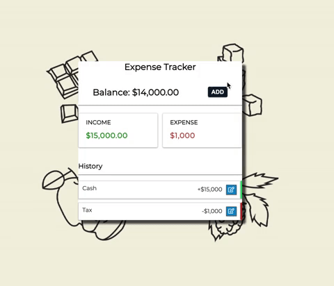

# Expense Tracker

A web interface built with MongoDB, Express, React, Node(MERN) for users to manage their daily transactions. Implementing with CRUD operations where users can create, update, delete their transactions and further review their spending history from previous periods.

Live Demo can be view at <https://expense-tracker-demo-c.herokuapp.com/>

---

## Project First Look



## Key Features

- Interfaces to create, update, delete, and view transactions (CRUD)
- View spending history and balance
- Implement with the MERN Stack

## Technologies

- Node.js
- Express.js
- MongoDB
- React
- Git/Github

---

## Installation

To run this project in your local machine, please follow the instructions below.

### Prerequisites

- [npm](https://docs.npmjs.com/)
- [Node.js](https://nodejs.org/en/)
- [MongoDB](https://docs.mongodb.com/manual/installation/)
- [concurrently](https://www.npmjs.com/package/concurrently)

### Clone

Clone this repository to your local machine

```{ .git }
git clone https://github.com/smallpaes/expense-tracker.git
```

### Setup

#### 1. Enter the project folder

```{console}
cd expense-tracker
```

#### 2. Install npm packages

```{console}
npm run install-all-deps
```

#### 3. Activate the server

```{console}
npm run dev
```

#### 4. Check the message for successful activation

```{console}
> Server is running on port 5000
> MongoDB connected!!
.
.
> Compiled successfully!
> You can now view expanse-tracker in the browser.
```

Your application will be run on browser with the URL: <http://localhost:3000>
